<link rel="stylesheet" type='text/css' href="https://cdn.jsdelivr.net/gh/devicons/devicon@latest/devicon.min.css" />

[][9]

Hi, there, 👋🼠 
I am Aayush Goyal from [India 🇮🇳](https://en.wikipedia.org/wiki/India).

### Listen to my some music first 🎷

# About Me
⏱ I have 6+ years of experience in the dynamic tech industry, predominantly within the FinTech domain. Currently, I am working as SDE-3 @ [Ola Krutrim](https://cloud.olakrutrim.com).

**💻 FUN FACT:** I have been coding since **2011**.

🎓 Graduating from [NIT Srinagar](https://en.wikipedia.org/wiki/National_Institute_of_Technology,_Srinagar) has taught me a few important life skills, notably resilience amidst challenges. I have applied this same principle throughout my career so far.

## ⌨️ My Arsenal

  <!-- Languages  -->
  

    <h4><strong>🈂️ Languages</strong></h4>
  

  

    •  TypeScript •  JavaScript (ES6) •  Dart •  Kotlin •  HTML5 •  CSS3 •  Java  Python 
  

<!-- Front-End -->

  

    <h4><strong>📱 Front-end</strong></h4>
  

  

  •  Next.js •  React.js •  Flutter •  SASS • CSS Modules •  Tailwind CSS • Styled Components • styled-jsx 
  

<!-- Back-End -->

  

    <h4><strong>🏗️ Back-end</strong></h4>
  

  

  •  Express.js •  Node.js • REST APIs •  GraphQL 
  

<!-- Libraries -->

  

    <h4><strong>📦 Libraries</strong></h4>
  

  

  • react-query • zustand • Browser APIs •  ESLint 
  

<!-- Cloud -->

  

    <h4><strong>☁️ Cloud</strong></h4>
  

  

  •  GCP •  Firebase 
  

<!-- DBs -->

  

    <h4><strong>💾 DBs</strong></h4>
  

  

   MongoDB •  Cloud Firestore •  PostgreSQL 
  

<!-- Tools -->

  

    <h4><strong>🛠️ Tools</strong></h4>
  

  

   VSCode •  IntelliJ IDEA •  Git •  GitHub •  Figma •  GitHub Actions • Miro • Retool  
  

<!-- Testing -->

  

    <h4><strong>🧪 Testing</strong></h4>
  

  

  •  Jest • Testing Library • </i> Playwright  
  

## 💼 Career
🏆 In my tenure as the founder of deriva, I made democratizing personal finance for Indians my end goal. I honed my product skills by teaching myself all the essential skills like UX Research, PDLC, and Stakeholder Management, and leveraging existing skills in Agile, SDE, and Leadership to deliver 2 MVPs (one with pivot). This was also when I truly learned the art of networking and used it to my advantage. My major achievements were raising funds from friends & family, and conducting thorough market and user research to understand the market space and business.

🌟 Then I joined 50Fin as a founding member. It was truly transformative. I wrote code, hired initial founding team members, collaborated on the initial product vision, and delivered an MVP with the product team in under 4 months. Additionally, I stocked pantry items!

🛠️ After taking a career break, I joined Pickright as a Technical Project Manager. Leading a team of 14 members was challenging but we successfully delivered 30 features in under 5 months which:
1. scaled the product to handle 1 million users,
2. made our product designs coherent and easy for users,
3. reduced daily bugs count by 70% and made the product stable,
4. delivered a few internal tools to collaborate with cross-functional teams, and
5. improved team efficiency by 20%.

🤖 Currently, I am build the next-gen AI and cloud platform @ Ola with a bunch of cool folks. I am working on the cloud console. Think of it as AWS but by India and for India. To know more, check out [Krutrim](https://cloud.olakrutrim.com).

## 💫 deriva

😄 A FinTech start-up trying to change finance is thought of. Currently, I am building a bunch of small and cool apps to make lives of Indians easier. Some of my current projects under deriva brand are: 

1. [tallileo](https://tallileo.com) - One app you need for all personal finance needs.
2. [Khelo](https://khelo.app) - Community driven badminton enthusiast sports app.
3. [Claro](https://claro.my) - Personal goals and productivity platform based on OKR concept.
4. [Prepped](https://prepped.cc) - STEM-based preparation platform with focus on bridging gap between academia and industry skills.
5. [NomNom](https://nomnom.life) - House utility app.
6. ...and many more to come

## ℹ️ About Me

📚 I love reading and have devoured 100+ novels since 2016. I boast about this fact because I used to be someone who hated reading. Now reading takes up a pretty heft amount of my daily routine.

💪🏼 I also try to keep my body in shape and working out is a part of my daily routine. You might also find me fighting for my team when I am playing a team sport or fighting for myself when I am playing an individual sport.

🚨 Views expressed are my own and do not reflect those of deriva Inc or ANI Technologies Pvt. Ltd., its management, employees, customers, or any other affiliated party.

🎙️ Have a quick 30-minute chat with me. Use my calendly link: https://calendly.com/aayushgoyal/one-on-one

✉️ Seeking new opportunities to further leverage my skill set, expand my learning horizons, and collaborate with an exceptional team in crafting stellar products that delight users. Reach out at aayushgoyal.mps@gmail.com.

# 👀 Stalk Me Here:
<!-- Website -->

<!-- Blog -->

<!-- LinkedIn -->

<!-- X -->

<!-- Stack Overflow -->

<!-- Google Maps -->

<!-- Instagram -->

# 🧑🏻‍💻 Some Coding Stats
**Top Coding Day**
<!-- WAKAWAKA_START -->
<!-- WAKAWAKA_CONFIG__STATS_BEST_DAY -->

<!-- WAKAWAKA_END -->

**Daily Coding Average**
<!-- WAKAWAKA_START -->
<!-- WAKAWAKA_CONFIG__STATS_DAILY_AVG -->

<!-- WAKAWAKA_END -->

**Total Lines of Code**

<!-- TODO: **Total Code Time** -->

**Language Chart**
<!-- WAKAWAKA_START -->
<!-- WAKAWAKA_CONFIG__ST=0&CT=0&DT=0&R=0 -->

<!-- WAKAWAKA_END -->

**Projects**
<!-- WAKAWAKA_START -->
<!-- WAKAWAKA_CONFIG__ST=4&CT=2&DT=0&R=0 -->

<!-- WAKAWAKA_END -->

**Editors**
<!-- WAKAWAKA_START -->
<!-- WAKAWAKA_CONFIG__ST=2&CT=4&DT=0&R=0 -->

<!-- WAKAWAKA_END -->

**NOTE:** Charts generated with [WakaWaka - Action](https://github.com/marketplace/actions/wakawaka-action)

## &#x1f4c8; My GitHub Stats

# ❤️ Support Me

You can support me by donating here [aayushgoyal - Donate][8], if you want. 🙏🏻

[8]: https://aayushgoyal.in/donate
[9]: https://tallileo.com
